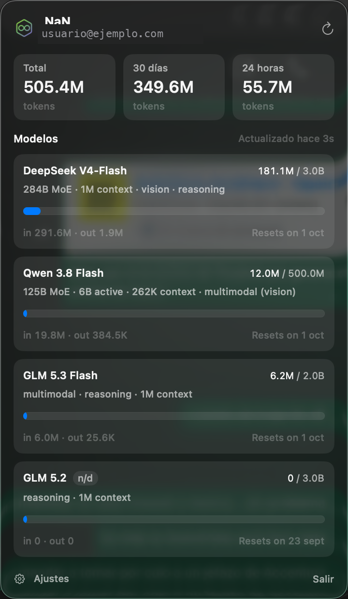
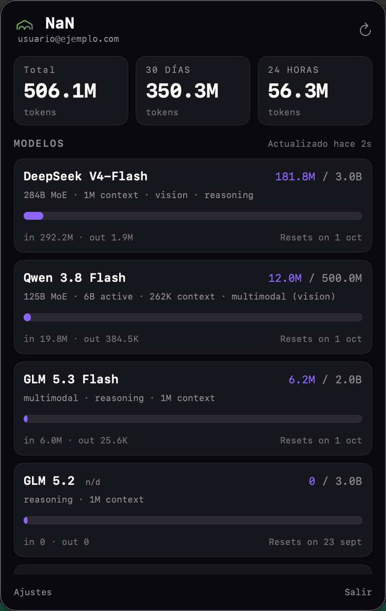
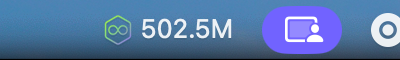

<h1 align="center">NaN Usage</h1>

<p align="center">
  <em>La cuota de tu suscripción de <a href="https://nan.builders">NaN</a> en la barra de menús de macOS, al estilo del monitor de uso de Claude.</em><br>
  <sub>A macOS menu bar app for your nan.builders quota — usage per model across 24 h, 30 days and all time.</sub>
</p>

<p align="center">
  
  
  
  
  
</p>

Una app de barra de menús con el isotipo de NaN y, si quieres, el consumo
acumulado al lado. Al hacer clic, un panel con el total de tokens, el consumo de
24 h / 30 días y una tarjeta por modelo con los tokens usados frente a su cap, el
desglose de entrada/salida y los días que quedan para el reset.

Está inspirada en las versiones para Linux de la comunidad:
[gnome-nan-usage](https://github.com/prgr1no/gnome-nan-usage) de prgr1no y
[kde-nan-usage](https://github.com/luciferfran/kde-nan-usage) de luciferfran. Esta
es una implementación nativa para macOS en Swift.

## Capturas

### Aspecto nativo de macOS

<p align="center">
  
</p>
<p align="center"><sub>El panel con el aspecto nativo: materiales del sistema, tipografía SF y el color de acento de tu Mac.</sub></p>

### Aspecto estilo web de NaN

<p align="center">
  
</p>
<p align="center"><sub>El mismo panel con el aspecto del dashboard de NaN: fondo oscuro, tipografía monoespaciada y acento violeta.</sub></p>

### Barra de menús

<p align="center">
  
  &nbsp;&nbsp;
  
</p>
<p align="center"><sub>A la izquierda, «Icono + total». A la derecha, «Solo icono».</sub></p>

### Ajustes

<p align="center">
  
</p>

## Características

- **Un vistazo desde la barra.** El isotipo de NaN y, opcionalmente, el consumo
  acumulado.
- **Dos aspectos.** Nativo de macOS (materiales, tipografía SF, color de acento
  del sistema y modo claro/oscuro automático) o el estilo del dashboard web de
  NaN, conmutable desde Ajustes.
- **Una tarjeta por modelo** con tokens usados, cap, barra de progreso, desglose
  de entrada/salida y la fecha de reset.
- **Consumo agregado** de 24 h, 30 días y total (all-time).
- **Modelos disponibles** desde `api.nan.builders/v1/models`; los que no están en
  tu plan se marcan como `n/d`.
- **Sin OAuth.** Lee la API key del mismo fichero que el resto de herramientas de
  la comunidad, o de la configuración de NaN en opencode.
- **Se porta bien con la API.** Si NaN falla y ya había datos, los conserva y lo
  dice.

## Requisitos

- **macOS 14 (Sonoma) o superior.** Probada en macOS 26 (Tahoe).
- **Xcode Command Line Tools** para compilar (`xcode-select --install`).
- **Una suscripción de NaN** con API key.

## Instalación

### En un comando

```sh
curl -fsSL https://raw.githubusercontent.com/ConJdeRumba/macos-nan-usage/main/scripts/install-online.sh | bash
```

Clona el repo, lo compila y deja `NaN Usage.app` en `/Applications`. ¿Prefieres
leerlo antes de ejecutarlo? Está en
[`scripts/install-online.sh`](scripts/install-online.sh).

### Manual (desarrollo)

```sh
git clone https://github.com/ConJdeRumba/macos-nan-usage.git
cd macos-nan-usage
./build.sh
open "build/NaN Usage.app"
```

`build.sh` compila con `swift build`, empaqueta el bundle `.app`, copia el icono
y firma en modo ad-hoc (necesario para que la app se sienta como una app normal
de macOS).

### Sin git

Descarga el código de la
[última release](https://github.com/ConJdeRumba/macos-nan-usage/releases/latest)
(botón «Source code»), descomprímelo y dentro de la carpeta ejecuta `./build.sh`.

## La API key

La app busca la API key en este orden:

1. La key guardada desde **Ajustes** (tiene prioridad y persiste).
2. La variable de entorno `NAN_API_KEY`.
3. `~/.config/nan/api-key` — el fichero estándar de la comunidad, el mismo que
   usan el CLI `nan`, gnome-nan-usage y kde-nan-usage.
4. La configuración de NaN en opencode
   (`~/.config/opencode/opencode.jsonc`) o su `auth.json`.

Para crear el fichero estándar con permisos correctos:

```sh
mkdir -p ~/.config/nan
(umask 177; printf %s 'TU_API_KEY' > ~/.config/nan/api-key)   # queda en modo 600
```

La key **nunca** sale en logs ni en mensajes de error.

## Ajustes

Desde **Ajustes** (el engranaje, abajo a la izquierda del panel):

| ajuste | qué hace | por defecto |
|---|---|---|
| `API key de NaN` | sobrescribe la key autodetectada y la guarda | vacío (autodetectada) |
| `Aspecto` (`nan.theme`) | `native` (macOS) o `web` (estilo dashboard de NaN) | `native` |
| `Barra de menús` (`nan.menuBarStyle`) | `iconAndTotal` (isotipo + total) o `iconOnly` (solo isotipo) | `iconAndTotal` |

Se guardan en los `defaults` de la app (`com.nan.menubar`). Para volver a los
valores por defecto:

```sh
defaults delete com.nan.menubar
```

## Cómo funciona

La API de inferencia de NaN (`api.nan.builders/v1`, LiteLLM) no expone uso. El
backend del panel web, `cloud-api.nan.builders`, sí, con **la misma API key**
como `Bearer`. Sus rutas salen del bundle JS del panel y **no tienen contrato
público**: pueden cambiar sin aviso.

| ruta | uso aquí |
|---|---|
| `GET /api/usage/quota` | `periodStart` y `models[]` con `tokensUsed`, `cap`, `remaining`, `periodEnd`; alimenta las barras |
| `GET /api/auth/me` | email, región y tier de la cabecera |
| `GET /api/metrics/usage` | consumo agregado 24 h / mes / 30 d / all-time por modelo |
| `GET /v1/models` | lista de modelos disponibles (en `api.nan.builders`) |

- **Sondeo cada 30 segundos** por defecto, más uno al abrir el panel y con «↻
  Actualizar».
- **La key se resuelve al arrancar** y cada vez que la cambias en Ajustes.
- **Todo el estado es local.** No hay servidor intermedio ni cuentas.

## Desarrollo y pruebas

```sh
swift build -c release       # compila
./build.sh                   # compila + empaqueta el .app
open "build/NaN Usage.app"   # ejecuta
```

El indicador, el panel y los ajustes solo se ven con la app en marcha. Para
iterar, cierra la app (`Salir`) y vuelve a abrir el `.app`.

## Desinstalar

```sh
rm -rf "/Applications/NaN Usage.app"
defaults delete com.nan.menubar   # borra ajustes y key guardada (opcional)
```

## Créditos

Esta app toma la idea y la estructura de datos de dos proyectos de la comunidad
para Linux:

- [**gnome-nan-usage**](https://github.com/prgr1no/gnome-nan-usage) (prgr1no) —
  la extensión original de GNOME Shell.
- [**kde-nan-usage**](https://github.com/luciferfran/kde-nan-usage) (luciferfran)
  — el widget de KDE Plasma 6.

Ambos descubrieron y documentaron las rutas de `cloud-api.nan.builders` que aquí
se reutilizan. La implementación de esta versión es nativa para macOS en Swift.

## Privacidad

Todo el tráfico va de tu equipo a NaN, con tu key. La app no manda datos a ningún
otro sitio, no guarda histórico y no escribe la key en ningún log.

## Licencia

**GPL-2.0-or-later.** Ver [LICENSE](LICENSE).

---

<sub>Proyecto de la comunidad, <strong>no oficial</strong>: no está afiliado ni
respaldado por nan.builders. «NaN» y su logotipo pertenecen a sus dueños; el icono
deriva de su favicon público.</sub>
