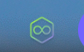
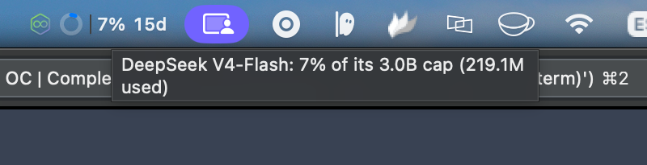
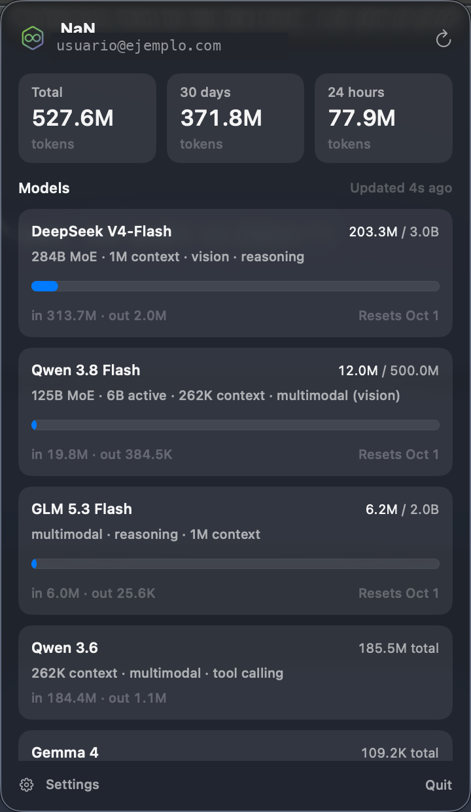
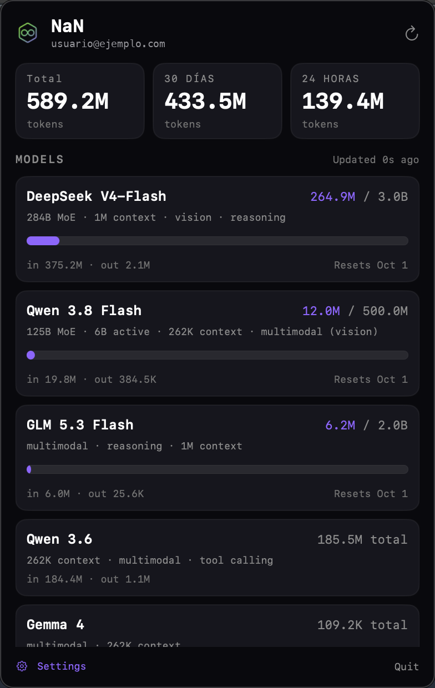
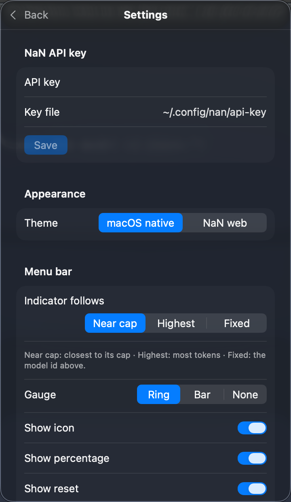
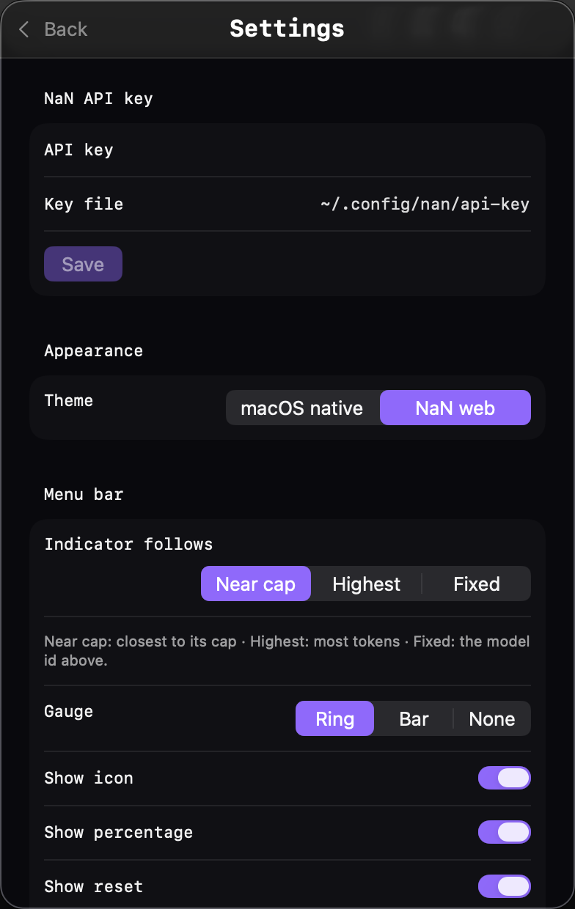

<h1 align="center">NaN Usage</h1>

<p align="center">
  <em>Your <a href="https://nan.builders">NaN</a> subscription quota in the macOS menu bar, in the style of the Claude usage monitor.</em><br>
  <sub>Per-model usage, time to reset and an aggregate view — native Swift, no dependencies.</sub>
</p>

<p align="center">
  
  
  
  
  
</p>

A menu bar app with the NaN mark and, optionally, a gauge with the level of the
model closest to its cap plus the days until it resets. Click it for a panel with
the total tokens, the last 24 h / 30 days and a card per model with tokens used
against its cap, the input/output split and the reset date.

Inspired by the community Linux versions:
[gnome-nan-usage](https://github.com/prgr1no/gnome-nan-usage) by prgr1no and
[kde-nan-usage](https://github.com/luciferfran/kde-nan-usage) by luciferfran. This
is a native macOS implementation in Swift.

## Screenshots

### Menu bar indicator

<p align="center">
  
</p>
<p align="center"><sub>Default: just the NaN mark and the gauge with the level of the model closest to its cap.</sub></p>

<p align="center">
  
</p>
<p align="center"><sub>With the percentage and the days to reset enabled.</sub></p>

<p align="center">
  
</p>
<p align="center"><sub>Or reduced to just the mark.</sub></p>

<p align="center">
  
</p>
<p align="center"><sub>Each piece has its own tooltip on hover: which model the percentage refers to, when it resets, and so on.</sub></p>

### Panel

## Themes

The app ships with two looks, switchable in **Settings → Appearance**:

| theme | looks like | follows |
|---|---|---|
| **macOS native** | system materials (vibrancy), SF typography and your Mac's accent color | light / dark automatically |
| **NaN web** | the NaN dashboard: dark background, monospaced type and violet accent | dark |

<p align="center">
  
  &nbsp;&nbsp;
  
</p>
<p align="center"><sub>Left: macOS native. Right: NaN web. The panel <em>and</em> the settings follow the chosen theme.</sub></p>

### Settings

<p align="center">
  
  &nbsp;&nbsp;
  
</p>
<p align="center"><sub>Settings follow the chosen look: macOS native (left) or NaN web (right).</sub></p>

## Features

- **Glance from the menu bar.** By default, the NaN mark and a gauge with the
  level of the chosen model. Add the used percentage, the days to reset, the
  model name or the all-time total if you want them.
- **Details on hover.** Each piece of the indicator has its own tooltip: the
  percentage tells you which model it refers to and its cap, the days tell you
  when it resets, and so on.
- **Two looks.** macOS native (materials, SF typography, system accent color and
  automatic light/dark) or the NaN web dashboard style, switchable in Settings.
  The panel and the settings both follow it.
- **One card per model** with tokens used, cap, a progress bar, the input/output
  split and the reset date.
- **Aggregate usage** for 24 h, 30 days and all time.
- **Available models** from `api.nan.builders/v1/models`; the ones outside your
  plan are flagged `n/a`.
- **No OAuth.** Reads the API key from the same file as the rest of the community
  tools, or from your NaN config in opencode.
- **Respects the API.** If NaN fails and data was already loaded, it keeps it and
  says so.

## Requirements

- **macOS 14 (Sonoma) or later.** Tested on macOS 26 (Tahoe).
- **Xcode Command Line Tools** to build (`xcode-select --install`).
- **A NaN subscription** with an API key.

## Install

### One command

```sh
curl -fsSL https://raw.githubusercontent.com/conjderumba/macos-nan-usage/main/scripts/install-online.sh | bash
```

It clones the repo, builds it and drops `NaN Usage.app` in `/Applications`. Prefer
to read it before running? It is at
[`scripts/install-online.sh`](scripts/install-online.sh).

### Manual (development)

```sh
git clone https://github.com/conjderumba/macos-nan-usage.git
cd macos-nan-usage
./build.sh
open "build/NaN Usage.app"
```

`build.sh` compiles with `swift build`, packages the `.app` bundle, copies the
icon and ad-hoc signs it.

### Without git

Download the source from the
[latest release](https://github.com/conjderumba/macos-nan-usage/releases/latest)
(the "Source code" button), unpack it and run `./build.sh` inside the folder.

## The API key

The app resolves the key in this order:

1. The key saved from **Settings** (stored in the login keychain).
2. The `NAN_API_KEY` environment variable.
3. `~/.config/nan/api-key` — the community standard file, the same one used by the
   `nan` CLI, gnome-nan-usage and kde-nan-usage. The path is configurable.
4. Your NaN config in opencode (`~/.config/opencode/opencode.jsonc`) or its
   `auth.json`.

To create the standard file with the right permissions:

```sh
mkdir -p ~/.config/nan
(umask 177; printf %s 'YOUR_API_KEY' > ~/.config/nan/api-key)   # mode 600
```

The key **never** appears in logs or error messages.

## Settings

From **Settings** (the gear at the bottom-left of the panel):

| key | what it does | default |
|---|---|---|
| `keyPath` | file with the API key (`~` works) | `~/.config/nan/api-key` |
| `theme` | `native` (macOS) or `web` (NaN dashboard) | `native` |
| `pollSeconds` | seconds between polls (60–1800) | `300` |
| `panelModel` | which model the indicator follows: `worst` (near cap), `max` (highest usage), `fixed` | `worst` |
| `panelModelId` | model used by `fixed` | `deepseek-v4-flash` |
| `panelGauge` | `ring`, `bar` or `none` | `ring` |
| `showIcon` | show the NaN mark | `true` |
| `showPercentage` | show the used percentage | `false` |
| `showReset` | show the days to reset | `false` |
| `showModel` | show the model name | `false` |
| `showTotalTokens` | show the all-time total | `false` |
| `showMetrics` | aggregate 24 h / 30 d line (one extra request) | `true` |
| `hideUnused` | hide models with zero usage in the panel | `true` |

About `panelModel`: **Near cap** follows whichever model is closest to its cap
(highest used/cap ratio), **Highest** follows the one with the most tokens used
this period, and **Fixed** always follows the model id you type.

The GNOME/KDE options `panelPosition`, `panelIndex` and `toggleMenu` do not apply
on macOS (the menu bar order is up to the user, and a global shortcut would need
extra permissions).

Settings live in the app's `defaults` (`com.nan.menubar`). To reset:

```sh
defaults delete com.nan.menubar
```

## How it works

NaN's inference API (`api.nan.builders/v1`, LiteLLM) does not expose usage. The
web dashboard backend, `cloud-api.nan.builders`, does, with **the same API key**
as a `Bearer` token. Its routes come from the dashboard's JS bundle and **have no
public contract**: they can change without notice.

| route | used for |
|---|---|
| `GET /api/usage/quota` | `periodStart` and `models[]` with `tokensUsed`, `cap`, `remaining`, `periodEnd`; feeds the gauges and bars |
| `GET /api/auth/me` | email, region and tier for the header |
| `GET /api/metrics/usage` | aggregate 24 h / month / 30 d / all-time per model |
| `GET /v1/models` | available models (on `api.nan.builders`) |

- **Level by threshold.** The gauge is drawn in your accent color, turns amber from
  75 % and red from 90 % of the cap.
- **Polling** every 5 minutes by default, plus one when you open the panel and on
  “↻ Refresh”.
- **Everything is local.** No middleman server, no accounts.

## Development

```sh
swift build -c release       # compile
./build.sh                   # compile + package the .app
open "build/NaN Usage.app"   # run
```

The indicator, the panel and the settings are only visible while the app is
running. To iterate, quit the app (`Quit`) and open the `.app` again.

## Uninstall

```sh
rm -rf "/Applications/NaN Usage.app"
defaults delete com.nan.menubar   # clear settings and the stored key (optional)
```

## Credits

This app takes the idea and the data shape from two community projects for Linux:

- [**gnome-nan-usage**](https://github.com/prgr1no/gnome-nan-usage) (prgr1no) —
  the original GNOME Shell extension.
- [**kde-nan-usage**](https://github.com/luciferfran/kde-nan-usage) (luciferfran)
  — the KDE Plasma 6 widget.

Both of them discovered and documented the `cloud-api.nan.builders` routes reused
here. This macOS version is a native Swift implementation.

## Privacy

All traffic goes from your machine to NaN, with your key. The app sends data
nowhere else, keeps no history and never writes the key to a log.

## License

**GPL-2.0-or-later.** See [LICENSE](LICENSE).

---

<sub>Community project, <strong>unofficial</strong>: not affiliated with or
endorsed by nan.builders. “NaN” and its logo belong to their owners; the icon is
derived from their public favicon.</sub>
